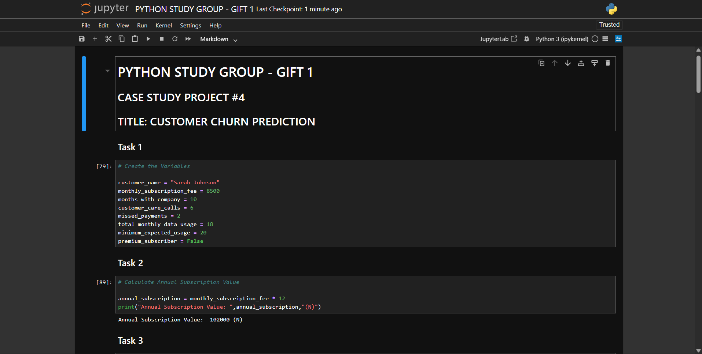
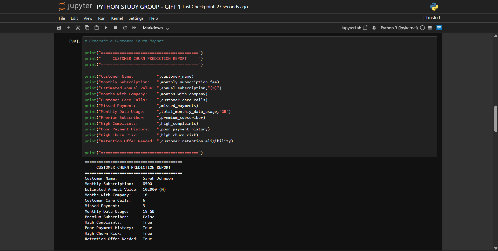
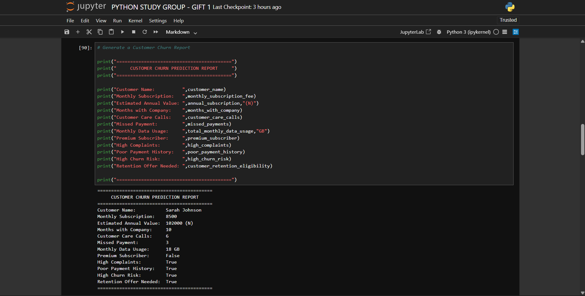
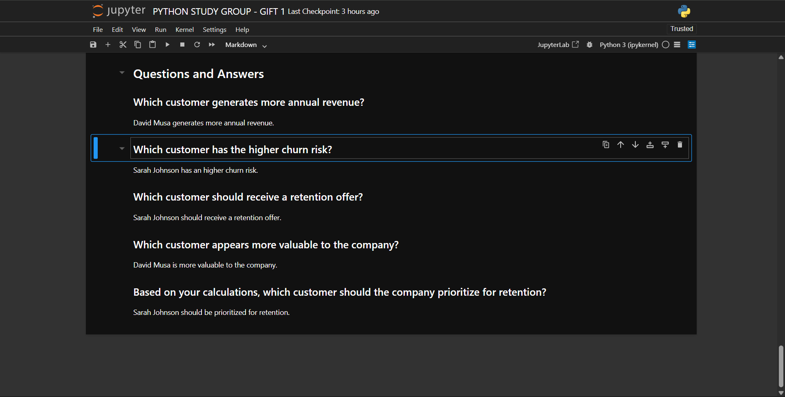
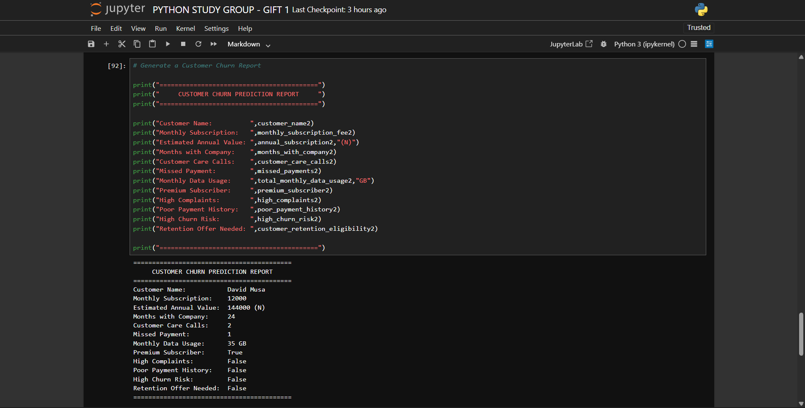

# Customer Churn Prediction Using Python

## Introduction

Customer retention is one of the biggest challenges faced by subscription-based businesses. Companies invest significant resources in acquiring new customers, so losing existing ones can lead to revenue loss and reduced profitability.

This project demonstrates how Python can be used to analyze customer data and identify customers who are likely to stop using a company's services, a phenomenon known as **customer churn**.

Rather than waiting until a customer leaves, businesses can use data to identify warning signs early and take proactive steps to improve customer satisfaction and customer retention.

---

# The Business Problem

Imagine you're working as a Data Analyst for a telecommunications company.

Every month, thousands of customers subscribe to mobile data plans and other services. While many customers remain loyal, others gradually become dissatisfied and eventually leave for competitors.

Some common warning signs include:

- Frequent calls to customer support
- Missed subscription payments
- Reduced service usage
- Declining customer engagement

Without analyzing this information, the company may not realize a customer is about to leave until it is too late.

This project aims to answer one important business question:

> **Which customers are most likely to churn, and which customers should receive a retention offer before they leave?**

---

# My Solution Using Python

Using Python fundamentals, I created a simple customer churn prediction program.

The program analyzes customer information such as:

- Customer name
- Monthly subscription fee
- Customer tenure
- Number of customer care calls
- Missed payments
- Monthly data usage
- Premium subscription status

Using arithmetic, comparison, assignment, and logical operators, the program evaluates customer behaviour and determines whether:

- The customer has high complaints
- Their payment history is poor
- They are at high risk of churning
- They should receive a retention offer

Although this project uses beginner-level Python concepts, it demonstrates how programming can be applied to solve a real business problem.

---

# Why This Problem Matters

Customer churn directly affects a company's profitability.

Retaining existing customers is often more cost-effective than acquiring new ones. By identifying customers who are likely to leave, businesses can:

- Reduce revenue loss
- Improve customer satisfaction
- Increase customer loyalty
- Make better business decisions using data
- Improve long-term profitability

Customer churn analysis is widely used in:

- Telecommunications
- Banking
- Insurance
- E-commerce
- Streaming platforms
- SaaS companies
- Healthcare
- EdTech

---

# Technologies Used

- Python 3
- Jupyter Notebook
- Github

---

# Python Concepts Applied

- Variables
- Data Types
- Arithmetic Operators
- Assignment Operators
- Comparison Operators
- Logical Operators
- Print Statements

---

# Project Workflow

1. Store customer information using variables.
2. Calculate annual subscription revenue.
3. Update customer payment records.
4. Evaluate customer data usage.
5. Determine complaint levels.
6. Evaluate payment history.
7. Predict churn risk.
8. Recommend whether a retention offer should be given.
9. Display a complete customer report.

---

# Project Screenshots

---

---

---

---

# Results

## Customer 1 — Sarah Johnson

- Annual Subscription Value: ₦102,000
- High Complaints: True
- Poor Payment History: True
- High Churn Risk: True
- Retention Offer Needed: True

---

## Customer 2 — David Musa

- Annual Subscription Value: ₦144,000
- High Complaints: False
- Poor Payment History: False
- High Churn Risk: False
- Retention Offer Needed: False

---

#  Key Findings

- David Musa generates more annual revenue.
- Sarah Johnson has the highest risk of churn.
- Sarah Johnson should receive a retention offer.
- David Musa appears to be the company's more valuable customer because of his higher revenue and lower churn risk.

---

# What I Learned

This project helped me understand that Python is much more than writing code.

I learned how programming can be used to solve practical business problems by transforming customer data into meaningful insights. I also gained hands-on experience applying Python fundamentals to create solutions that can impact real business decisions.

---

#  Author

**Ayotomiwa Owolabi**

Python Data Analytics & Data Science Student

GitHub: https://github.com/Oluwa-fisayomi
